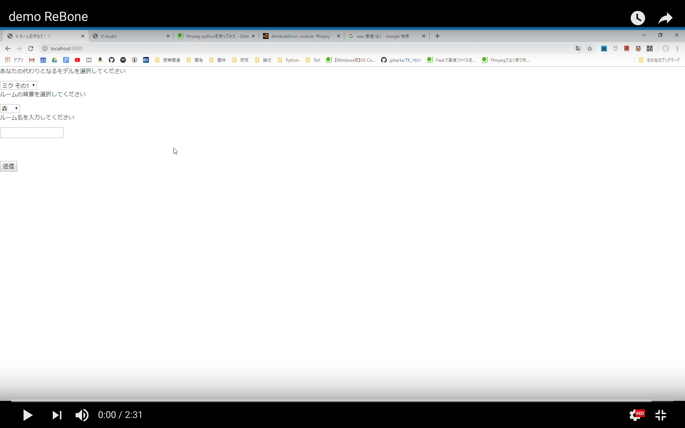

# ReBone

## 製品概要
### 動画をアップロードするだけ！誰でも簡単バ美肉体験！

### 背景（製品開発のきっかけ、課題等）
バーチャル美少女受肉、略してバ美肉。Vtuberが知られるようになってから、我々男性にとってバーチャル美少女になることは悲願でした。しかし、美少女の姿になっても声が変えられない、声を変えても出したい声にならない、そもそも機材が買えない等、美少女になるためのハードルは未だ高く険しいのです。我々はそんな状況を打破すべく、動画を送信するだけで声も姿も美少女になれるようなWEBサイトをつくりたいと考えました。

### 製品説明（具体的な製品の説明）
こちらに製品の概要・特徴について説明を記載してください。

### 特長

#### 1. 特長1:プラットフォームとしての特徴
- ブラウザからアクセスするので、インストール不要＆機種依存しにくい
- 好きな角度から美少女を閲覧できる

#### 2. 特長2:画像処理
- 動画を撮るだけで簡単に美少女になれる
- 特別な機材は必要なし！奥行きや回転まで自動で計算

#### 3. 特長3
- 声まで女の子になれる
- 好きな女の子の声を選べる

### 解決出来ること
環境構築などの手間いらずで、vtuber体験が出来る。
vtuber体験の敷居を下げる。

### 今後の展望
- UIの改善（見やすさに加えてツイッター投稿などの機能追加）
- モーションのクオリティ改善（今回１日かけて取り組んだが、改善できなかった）
- 音声変換のクオリティ改善（今回は学習を２回しか試せなかった＆データが少ない、汚い）
- 音声変換のバリエーション増加（VOCALOIDなら学習データ作成が容易）

## 開発内容・開発技術
### 活用した技術
#### API・データ
* [VMD-Lifting](https://github.com/errno-mmd/VMD-Lifting)
* AWS
* Docker

#### フレームワーク・ライブラリ・モジュール
* Python3
* Flask
* three.js
* OpenCV
* python-tk
* PyQt5
* tensorflow

### 独自開発技術（Hack Dayで開発したもの）
#### 2日間に開発した独自の機能・技術
* カメラ、マイクからwebmを出力
* Webカメラから映像、音声を分離し、サーバに送信
* モデル表示ページに背景画像を表示できるようにした
* 機械学習モデルなど、３人のプロダクトを統合
