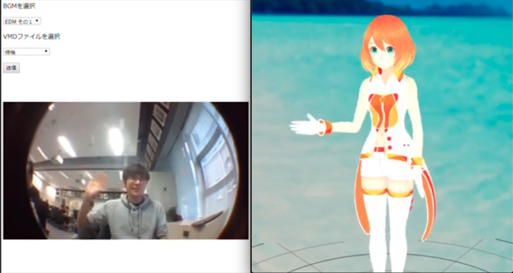

# ReBone

## 製品概要
### 動画をアップロードするだけ！誰でも簡単バ美肉体験！

### 背景（製品開発のきっかけ、課題等）
ここに
- こんかいのプロダクトの開発に至った背景
- 着目した顧客・顧客の課題・現状
を記入してください

### 製品説明（具体的な製品の説明）
こちらに製品の概要・特徴について説明を記載してください。

### 特長

#### 1. 特長1

#### 2. 特長2

#### 3. 特長3

### 解決出来ること
この製品を利用することによって最終的に解決できることについて記載をしてください。

### 今後の展望
今回は実現できなかったが、今後改善すること、どのように展開していくことが可能かについて記載をしてください。

## 開発内容・開発技術
### 活用した技術
#### API・データ
今回スポンサーから提供されたAPI、製品などの外部技術があれば記述をして下さい。

* [VMD-Lifting](https://github.com/errno-mmd/VMD-Lifting)
* 
* 

#### フレームワーク・ライブラリ・モジュール
* Python
* Flask
* OpenPose
* tensorflow

#### デバイス
* 
* 

### 独自開発技術（Hack Dayで開発したもの）
#### 2日間に開発した独自の機能・技術
* 独自で開発したものの内容をこちらに記載してください
* 特に力を入れた部分をファイルリンク、またはcommit_idを記載してください（任意）
